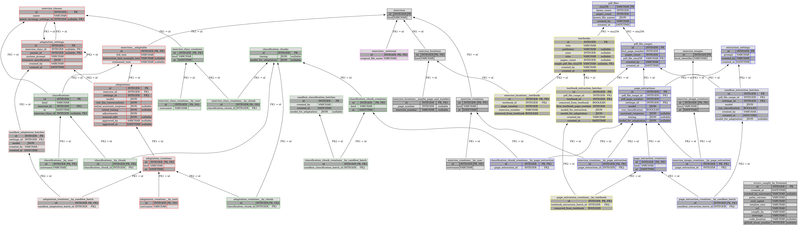
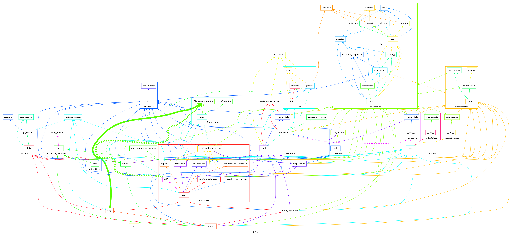

<!-- Copyright 2025 Vincent Jacques <vincent@vincent-jacques.net> -->

*Patty* is a web application designed to help the MALIN team experiment with adapting exercises using LLMs and other AI tools.

This README is designed to be read linearly once, from start to end.
It starts at a high level then goes into more and more details regarding *Patty*'s functionality and technical design, and gives pointers about how to continue *Patty*'s development.

# Authors & Licensing

*Patty*'s authors are, in `random.shuffle` order:

- [Elise Lincker](https://github.com/eliselinc/) (classification)
- [Mohamed Amine Lasheb](https://aminelasheb.github.io/) (extraction)
- [Vincent Jacques](https://vincent-jacques.net/) (everything else, until 2025-12-31)

No license has been chosen yet, so all author's rights are reserved for now.
**TODO: We must choose a license to allow anyone else than the original authors to use or contribute to this project. We must not let people think they can do so freely, because we would mislead them into doing something illegal.**

# Main functionality

Children with [dyspraxia](https://en.wikipedia.org/wiki/Developmental_coordination_disorder) have difficulties writing texts by hand.
Needing to focus on their hand writing gestures makes it harder for them to learn beyond writing (grammar, literature, *etc.*).
It's often easier for them to type on a keyboard or use a mouse.

Some non-profit organizations and teachers have been "adapting" exercises from textbooks into digital formats more usable by pupils.
This is a long and tedious process, which limits the amount of available adapted exercises.

The MALIN project aims to automate this adaptation process, and *Patty* is an attempt towards this goal.
*Patty* takes as input the PDF version of a textbook, uses various AI tools to extract and adapt the exercises, and outputs an HTML file containing the adapted exercises.
This file is autonomous: it can be copied on any computer, and opened in a web browser without internet connectivity.

*Patty* also has "sandbox" features to help engineering the LLM prompts used for extraction and adaptation.
This functionality is described after the main pipeline description.

# Pipeline

Here are the steps *Patty* performs to adapt exercises from a textbook.

## PDF conversion

The input PDF file is first converted to PNG files, one image per page.

## Illustrations detection

Some exercises may have illustrations (*e.g.* when the pupils have to describe objects in a picture).
*Patty* starts by detecting illustrations in the PDF pages, and extracting them.

Illustrations are extracted and stored for later use in the "export" step.
They are also annotated on the page images, to let the extraction LLM (in next step) know about them.

## Text and styles extraction

The text and styles (fonts, sizes, colors, *etc.*) are extracted from the PDF file using [PyMuPdf](https://pymupdf.readthedocs.io/en/latest/).

## Extraction

Annotated page images, and text and styles extracted from the PDF, are then processed by an LLM with a prompt designed to extract exercises.
The LLM outputs a JSON structure describing the exercises found on each page.

## Classification

Extracted exercises are then classified into various categories (multiple choice, fill in the blanks, *etc.*).
This classification is used to choose the appropriate adaptation strategy for each exercise in the next step.

## Adaptation

Each exercise is then processed by an LLM with a prompt designed to produce a JSON representation of its adapted version.
Different adaptation prompts are used depending on the exercise category determined in the previous step.

## Export

Adapted exercises are bundled (in JSON form) into a standalone HTML file.
Extracted images and external exercises (*e.g.* Microsoft Word or Excel files) are also included in this file.

## Rendering and use

The pupil opens the standalone HTML file in their web browser, which renders the adapted exercises as interactive elements.
Pupils' answers are recorded in their browser's local storage to be later checked by their teachers.

# Sandbox functionality

*Patty*'s sandbox features let users experiment with different LLM prompts for the extraction and adaptation steps.

Sandbox users can create batches at three levels: extraction, classification, and adaptation, allowing them to change the prompts used for each step.

The latest prompts are then used in subsequent textbook extractions and adaptations.

Sandbox features are intended for the MALIN team, and will be hidden from regular users in production.

# Technical design

*Patty* is made of these services:

```mermaid
flowchart LR
  user[🧍 User]

  subgraph Browser
    frontend[Frontend]
  end

  subgraph Server
    fanout[Fanout]
    frontend_server[Frontend server]
    backend_api[Backend API server]
    submission_daemon[Submission daemon]
    backup_cron_job[Backup cron job]
    database[Database]
  end

  user --> frontend
  frontend -->|HTTP| fanout
  fanout -->|HTTP| frontend_server
  fanout -->|HTTP| backend_api
  backend_api -->|SQL| database
  submission_daemon -->|SQL| database
  backup_cron_job --> database
```

## User and frontend

The user interface is a web application running in the user's browser (the frontend).
It is written in [Vue.js](https://vuejs.org/).
It uses an HTTP JSON API to communicate with the backend.

In development, it's served by a [Vite](https://vitejs.dev/) development server with auto-reload.

For production, it's compiled into a set of static files using Vite.
Those static files are then served an [Nginx](https://www.nginx.com/) server.

## Fanout

To avoid issues with CORS and use a single DNS address, all requests from the browser go through a "fanout" component: an Nginx server configured as a reverse proxy.
It routes all requests for paths starting with `/api/` to the backend API server, and all other requests to the frontend server.

## Backend API server

The backend API server is implemented in Python using [FastAPI](https://fastapi.tiangolo.com/) and [SQLAlchemy](https://www.sqlalchemy.org/)'s ORM to interact with the database.

It only performs quick operations.
Longer operations are just recorded in the DB as "needing to be performed", and are later executed by the submission daemon.

It runs in a [Uvicorn](https://www.uvicorn.org/) server, both in development and production, with auto-reload enabled in development.

## Database

The database is a [PostgreSQL](https://www.postgresql.org/) server.

## Submission daemon

The submission daemon is a Python program that performs the long-running tasks of the application (illustrations detections, exercises extractions, classifications, adaptations).
It periodically checks the database for new tasks to perform, executes them, and records the results back in the database.

It shares its code base with the backend API server.
Most notably, it uses the same ORM models to read and write data in the database.

## Backup cron job

The backup [cron](https://en.wikipedia.org/wiki/Cron) job dumps the database periodically.
The dump files can be used to restore the database in case of data loss.

# External services

*Patty* relies on a few external services configured through environment variables.

This section gives an overview of these services and the names of the main environment variables used to configure them.
These variables are documented in details in `./backend/patty/settings.py`.

## LLM providers

The extraction and adaptation steps use LLMs from external providers, through their API.

Currently, extraction can only use [Google Gemini 2.0 Flash or 2.5 Flash](https://gemini.google.com/).

Adaptation can use:
- Google Gemini 2.0 Flash or 2.5 Flash
- [OpenAI GPT-4 variants](https://openai.com/)
- [MistralAI large, medium, and small variants](https://www.mistral.ai/)

They are configured using *e.g.* `PATTY_MISTRALAI_API_KEY`.

## Models used locally

Illustration detection uses a custom-trained [Ultralytics YOLO](https://docs.ultralytics.com/) model, and classification uses a custom-trained [CamemBERT](https://almanach.inria.fr/software_and_resources/CamemBERT-fr.html) model.

Both these model files must be available locally on the machine running the submission daemon, at locations set by *e.g.* `PATTY_IMAGES_DETECTION_MODEL_2025_09_15_PATH`.

## Data storage

Several kinds of files are stored durably:

- uploaded textbook PDFs, to be processed by the daemon
- extracted illustrations, to be included in the exported HTML files
- external exercises files (Microsoft Word, Excel, *etc.*), for the same reason

Conceptually, these files are an extension of the database.
Technically, they can't be stored in the database itself, so they are stored in an external storage service instead.
Each of these files is associated with specific database row, and is even named using the primary key of that row.

Two storage providers are supported:
- the local file system
- [Amazon S3](https://aws.amazon.com/s3/)

They are configured using *e.g.* `PATTY_EXTERNAL_EXERCISES_URL`.
If S3 is used for any of these, then S3 credentials must be provided through `AWS_ACCESS_KEY_ID` and `AWS_SECRET_ACCESS_KEY`.

## Monitoring

*Patty* should be monitored as an HTTP application.

In addition, it supports [pulse monitoring](https://updown.io/doc/how-pulse-cron-monitoring-works) for its cron-like and polling processes.
*E.g.* a failure in the submission daemon can be detected by setting up the `PATTY_SUBMISSION_DAEMON_PULSE_MONITORING_URL` environment variable.

## Mailing

When a crash is detected in the frontend, *Patty* records the error, and can send an email to the development team.
This is configured through the `PATTY_SMTP_*` environment variables.

# Development

## Dependencies

To start developing *Patty*, you only need Bash, Git, Python (with `venv`) and Docker (with `docker compose`) on your machine.

Start by `git`-cloning this repository and navigate to the repository directory.

## Scripts

`./dev.sh run` starts the development environment.

The first time you run it, it will ask you to create a few files according to templates.
These files contain secret environment variables that must not be stored in the repository (API keys, AIM credentials, *etc.*).
The template files will point you at the documentation about what values to put in these files.

It will also ask you to add some `*.pt` model files in the repository.
You can get these files from the project maintainers.

You can then visit http://localhost:8080/.
The password is `password`.

When the development environment is running, `./dev.sh cycle` runs all checks (linter, type checkers, tests, *etc.*).
It has a many options to run only some checks; see `./dev.sh cycle --help` for details.
This project has only had a single developer so far, so there is no CI/CD and running this development cycle script is crucial.

Use `./dev.sh --help` to list other commands available.

# Production

`./prod.sh preview` runs a production-like environment locally.

Currently, *Patty* uses Docker images owned by [@jacquev6](https://hub.docker.com/repositories/jacquev6).
For future deployments of Patty you'll need to change that and publish your new equivalent Docker images elsewhere.

All current Patty Docker images are named `jacquev6/patty`, and tagged according to their role and versions:
- `jacquev6/patty:preview-backend` and `jacquev6/patty:preview-frontend` for the preview environment, built during `./prod.sh preview`
- `jacquev6/patty:YYYYMMDD-HHMMSS-backend` and `jacquev6/patty:YYYYMMDD-HHMMSS-frontend` for production, where `YYYYMMDD-HHMMSS` is the timestamp of the build, built and published during `./prod.sh publish` (see below)
- (and `jacquev6/patty:dev-backend` and `jacquev6/patty:dev-frontend` for the development environment, built during `./dev.sh run`)

`./prod.sh pre-warm-build-cache` pulls base Docker images and installs dependencies, keeping result in cache.
It lets you choose when you want to run the long part of the build.

`./prod.sh publish` publishes new Docker images.
It does *not* pull the base images, so you should have run `./prod.sh pre-warm-build-cache` in the not-so-distant past.

The actual production deployment is outside the scope of this repository.
It should be done similarly to the preview environment, but with actual secrets and proper hosting.

# Code-base organization

Code for the API and the submission daemon is in a Python package in the `./backend/patty/` directory.

Code for the Vue.js frontend is in the `./frontend/` directory.

Support scripts for development and production are in `./dev.sh` and `./prod.sh` and use code in the `./support/` directory.

Python unit tests are in the file they cover.
They use the standard `unittest` module.

Tests for Vue.js components are in a file with the same base name as the component's file, with a `*.cy.ts` suffix.
They use [Cypress](https://www.cypress.io/).
Some component tests produce snapshots stored in a `*.cy.ts.screenshots/` directory.

End-to-end tests are in the `./frontend/e2e-tests/` directory.
They also use Cypress.
Some also produce snapshots stored in a `*.cy.ts.screenshots/` directory.

## Backend

### Packages

The `./backend/patty/` sub-packages are named according to their responsibilities.

Three sub-packages correspond to the three main steps of the adaptation pipeline:

- `./backend/patty/extraction/`: the extraction step. It contains `./backend/patty/extraction/extracted.py` with the data models for extracted exercises.
- `./backend/patty/classification/`: the classification step
- `./backend/patty/adaptation/`: the adaptation step, and `./backend/patty/adaptation/adapted.py` with the data models for adapted exercises.

Other important sub-packages include:

- `./backend/patty/asgi.py` and `./backend/patty/api_router/`: ASGI application for the API server
- `./backend/patty/textbooks/`: textbook management
- `./backend/patty/sandbox/`, with `./backend/patty/sandbox/extraction/`, `./backend/patty/sandbox/classification/`, and `./backend/patty/sandbox/adaptation/`: sandbox features for prompt engineering
- `./backend/patty/export/templates/`: HTML templates for the autonomous HTML files.
These are generated from the Vue.js code in `./frontend/src/export/` (see below).

### ORM models

ORM models are in each sub-package's `orm_models.py` file.

Polymorphism is used to keep sub-packages as loosely coupled as possible.

Here is a graph of the ORM models and their relationships. (Colors indicate sub-packages.)

[Alembic](https://alembic.sqlalchemy.org/) is used to manage database migrations.

### Entry points

The entry point for the API server is `./backend/patty/asgi.py`.
It's an ASGI application that can be run with `uvicorn`.

The entry point for the submission daemon is in `./backend/patty/__main__.py`, in the command `run_submission_daemon`.

The entry point for the backup job is also in `./backend/patty/__main__.py`, in the command `backup_database`.
Command `restore_database` restores the database from a dump file.

### Dependency graph

Here is a partial graph of the Python dependencies in the backend.

## Frontend

The `./frontend/` directory contains the configuration files for the Vue.js application (*e.g.* `./frontend/package.json`, `./frontend/vite.config.ts`, *etc.*).

The main source code is in `./frontend/src/`.
It's organized with the following sub-directories:

- `./frontend/src/frontend/`: the interface for the application
- `./frontend/src/export/`: entry point for the autonomous HTML files generated by the application
- `./frontend/src/adapted-exercise/`: components to render adapted exercises, used in the previews in the application's interface, and in the standalone HTML files
- `./frontend/src/reusable/`: generic components, that could be reused in other projects

### Frontend entry point

The entry point for *Patty*'s main user interface is `./frontend/src/frontend/index.html`.
Its Vue application (*incl.* configuration for routing, i18n, *etc.*) is in `./frontend/src/frontend/main.ts`.

Here are some important sub-directories in `./frontend/src/frontend/`:

- `./frontend/src/frontend/basic/`: the main layout of the application, not related to its specific functionality
- `./frontend/src/frontend/sandbox/`: interface for the sandbox features
- `./frontend/src/frontend/textbooks/`: interface for textbook management
- `./frontend/src/frontend/common/`: components used in both the sandbox and textbook parts

### Export entry points

The entry points for the autonomous HTML files generated by the application are in `./frontend/src/export/`.
They are produced by the Vite build process.
They each produce a single HTML file in `./backend/patty/export/templates/` (not depending on any other assets), which is then used by the backend to generate the autonomous HTML files.

## End-to-end tests

They are organized by feature and named accordingly.

## Support tools

### Scripts

The support tools' entry points are `./dev.sh` for development and `./prod.sh` for production.
These are thin wrappers around `./support/run.sh`, which in turn is a wrapper around a [Click](https://click.palletsprojects.com/) application in `./support/tool/__main__.py`.

The support tool is split in a `dev` and `prod` sub-commands, each with their own sub-commands.

Because of some poor decisions, some development utilities are currently in `./backend/patty/__main__.py`.
This is the case for example for the code that generates the dependency and ORM graphs above.
They could be moved to `./support/tool/dev/` if it becomes a priority.

### Docker-compose development environment

The development environment (run by `./dev.sh run`) is defined in `./support/dev-env/compose.yml`.
Other directories in `./support/dev-env/` contain data specific to a few services (*e.g.* database backups, fanout configuration file, *etc.*).
